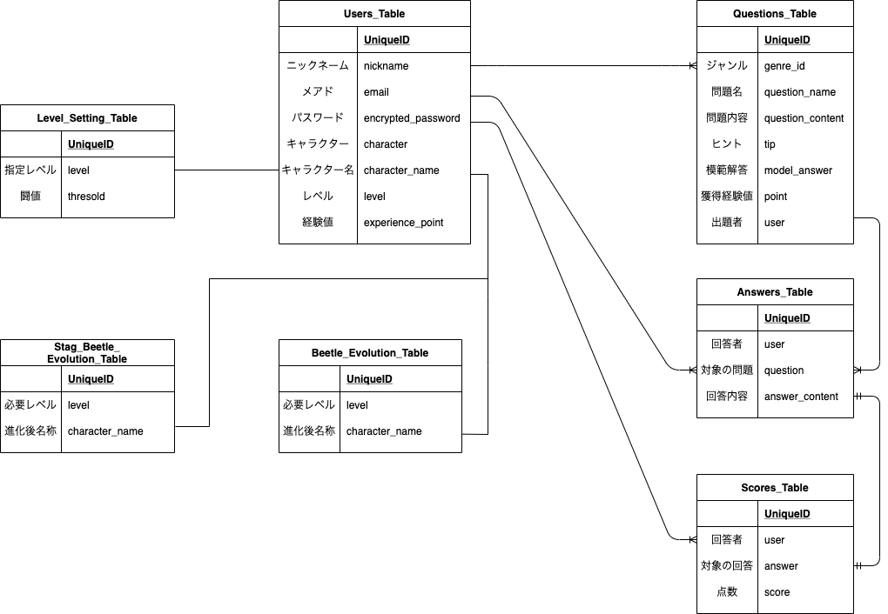

# README
# アプリ名
  ## spp_app
  Si Potes Probareの頭文字から成っています。 
  ラテン語で『やればできる』という意味の言葉です。 
# 概要
  国語、算数、英語から好みの課題を選択し、課題にチャレンジ出来ます。 
  課題に解答後、採点結果に応じて経験値を獲得!! 
  獲得経験値が一定数貯まると、ユーザーがレベルアップします！ 
  それだけでありません。なんと、一定レベルまで育成するとキャラクターが進化します! 
  最終進化まで達成すると圧巻の見た目に... 
  夢中でレベル上げを行っていると、いつの間にか学校の授業の予習・復習になっています。 
  それどころか、PC操作まで覚えてしまえる優れもの！ 
  もちろんipad対応しているので、いつでもどこでもプレイ出来ます。 
  これでキミもゲーム(勉強)マスターだ!!

# 制作背景
  本アプリケーションは、人生を変える学習アプリです。  
  だれでもお勉強が好きになれる。自分でもできる自信がつく。  
  そんな想いを実現すべく開発に着手しました。  

  『学校のお勉強は好きじゃない。だって面白くないから。』そんな事を言う男の子が居ました。  
  その男の子はゲームが大好きです。ものすごい集中力を発揮して、自ら攻略本を読み、どんどんクリアしていきます。  
  お勉強とゲーム。この違いはなんだろうか？？ 答えは成功体験だと考えました！  
  一生懸命に漢字を書いても、バランスが悪いと言われ...。  
  一生懸命に計算をしても、途中の計算式が抜けていると言われ...。  
  自分が頑張った結果がなんの形にもならない。その先に辿り着いたのは『面白くない』と言う想い。  
  無限の可能性を秘めた子供が『面白くない』と閉ざしたその感情は、なんともったいないことでしょう。  
  知らない事を知る。出来なかった事が出来る様になる。それが楽しい事だと気付くのは、きっともう少し先の事になるでしょう。  
  その時に『もう少し勉強しておけば...』そんな思いをして欲しくない。  
  そう願ったから生まれた学習アプリ。それがSPP_APPです！

# ペルソナ
- 年齢：6~8才
- 職業：小学生低学年
- 性別：男の子
- 状況1：幼稚園から小学校に入学し、毎日お勉強を頑張っているものの、なかなか理解ができず授業がつまらないと思っている
- 状況2：ポケモンのゲームなど好きな事には、凄い集中力を発揮する
- 状況3：お勉強もゲームだったら良いのにと感じている
- 状況4：室内、室外問わず遊ぶことが大好きで、虫に興味がある

# 本番環境
https://spp-app-35965.herokuapp.com/  

# Basic認証
- ID:admin
- Pass:2222

# テスト用アカウント
- Eメール : test1@test.com
- パスワード : 111111

# 動作確認方法
- Chromeの最新版を利用してアクセスしてください。  
ただしデプロイ等で接続できないタイミングもございます。その際は少し時間をおいてから接続ください。
- 接続先およびログイン情報については、上記の通りです。
- 同時に複数の方がログインしている場合に、ログインできない可能性があります。
- テストアカウントでログイン→トップページから科目を選択し、問題選択→解答入力→採点の流れです。
- ヘッダー部のユーザー名をクリックするとマイページへ遷移出来ます。マイページではユーザーの詳細情報が確認出来ます。
- 動作確認後、ログアウト処理をお願いします。

# 工夫した、こだわったポイント
- 未ログイン状態で20秒経過したら、新規登録かログインを案内するメッセージが表示される  
  『初めは何をすれば良いか分からなかった。案内があれば良かった。』と言う**ユーザーからの意見を採用**
- レベルアップや進化したタイミングで通知する仕組みを導入した
- レベルアップ通知からマイページに遷移できる様にリンク設定した(**ユーザーからの意見を採用**)
- マイページでは経験値情報を視覚的に捉えられる様に経験値指標を配置
- 死ねや殺すなど、不適切な言葉は保存出来ない様にバリデーションを掛けている
- 本番環境でアプリを見る方の中には、虫が苦手な方も居ると思い画像はイラストを採用
- 基本的にはひらがなを使用するが、課題作成ページには漢字を使用  
  課題を解くだけでなく、自分で考えた課題を作ってみたい！と前向きな考えになったペルソナを想定して、課題作成ページには漢字が使われている

# DEMO
### 未ログイン状態で20秒経過した場合、新規登録かログインを案内するメッセージ

### ログイン後、科目を選択すると問題一覧を確認出来ます。 既に解答済みの問題にはチェックが入っていますので、未解答の問題が視覚的に分かります。

### 問題をクリックすると、解答する事が出来ます。

### 答え合わせページへの遷移します。 この段階で答え合わせをしなかった場合、別途マイページから答え合わせ出来ます。

### 自己採点した際に経験値を獲得します。条件を満たすとレベルアップします。

### flashメッセージもしくは、ユーザー名をクリックするとマイページに遷移します。

### 一定レベルに達するとキャラクターが進化します。

# 今後の課題や実装予定
 ### 1.採点完了後にトップページに遷移するが、もう一度課題を解く為には科目を選ばなければならない  
ユーザーから『正直めんどくさい』と意見を頂いたので操作性改善を検討  
### 2.インフラ構築をAWS(EC2)に変更
昨今のインフラ環境ではAWS(EC2)やdockerの導入は当たり前との声も聞く為、自習対象  
### 3.育成キャラクターの種類を増やす
ユーザーからの需要があれば、育成キャラを増やす事を検討

# 使用技術(開発環境)
## バックエンド
Ruby, Ruby on Rails
## フロントエンド
HTML, CSS, javascript
## インフラ
MySQL, SequelPro
## ソース管理
GitHub, GitHubDesktop
## テスト
RSpec
## エディタ
VSCode

# テーブル設計

## ER図

## users テーブル
| Column             | Type    | Options                       |
| ------------------ | ------- | ----------------------------- |
| nickname           | string  | null: false                   |
| email              | string  | null: false, unique: true     |
| encrypted_password | string  | null: false                   |
| character          | string  | null: false                   |
| character_name     | string  | null: false, default: "たまご" |
| level              | integer | null: false, default: "1"     |
| experience_point   | integer | null: false, default: "0"     |

### Association

- has_many :questions
- has_many :answers
- has_many :scores

## questions テーブル
| Column             | Type       | Options                        |
| ------------------ | ---------- | ------------------------------ |
| genre_id           | integer    | null: false                    |
| question_name      | string     | null: false                    |
| question_content   | string     | null: false                    |
| tip                | string     |                                |
| model_answer       | string     | null: false                    |
| point              | integer    | null: false                    |
| user               | references | null: false, foreign_key: true |

### Association
- belongs_to :user
- has_many   :answers

## answers テーブル
| Column             | Type       | Options                        |
| ------------------ | ---------- | ------------------------------ |
| user               | references | null: false, foreign_key: true |
| question           | references | null: false, foreign_key: true |
| answer_content     | string     | null: false                    |

### Association
- belongs_to :user
- belongs_to :question
- has_one    :score

## scores テーブル
| Column   | Type       | Options                        |
| -------- | ---------- | ------------------------------ |
| user     | references | null: false, foreign_key: true |
| answer   | references | null: false, foreign_key: true |
| score    | integer    | null: false                    |

### Association
- belongs_to :user
- belongs_to :answer

## level_setting テーブル
| Column             | Type    | Options      |
| ------------------ | ------- | ------------ |
| level              | integer | null: false  |
| thresold           | integer | null: false  |

### Association

## beetle_evolution テーブル
| Column             | Type    | Options      |
| ------------------ | ------- | ------------ |
| level              | integer | null: false  |
| character_name     | string  | null: false  |

## stag_beetle_evolution テーブル
| Column             | Type    | Options      |
| ------------------ | ------- | ------------ |
| level              | integer | null: false  |
| character_name     | string  | null: false  |

